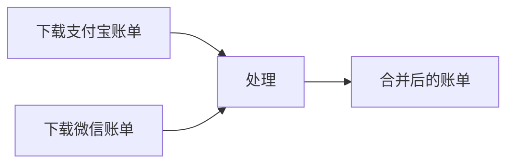

# alipay-wechat-merge

合并从支付宝、微信下载的 .csv 格式账单。

## 说明

本程序适应以下格式的账单文件：

|账单|数据列|汇总行|编码格式|
|----|----|----|----|
|支付宝|16项| 前4行|gbk|
|微信|11项| 前16行|utf-8|

```txt
1. 支付宝账单包含16项：
// []string{"交易号", "商家订单号", "交易创建时间", "付款时间 ", "最近修改时间", "交易来源地", "类型", "交易对方", "商品名称 ", "金额（元）", "收/支", "交易状态 ", "服务费（元）", "成功退款（元）", "备注", "资金状态"}

2. 微信账单包含11项：
// []string{"交易时间", "交易类型", "交易对方", "商品", "收/支", "金额(元)", "支付方式", "当前状态", "交易单号", "商户单号", "备注"}

```

## 使用方式



### Step 1 下载账单

#### 下载微信账单

1. 进入手机版微信，选择 “我”，进入用户中心界面，点击 “服务” 选项；
2. 点击 “钱包”，进入钱包界面后，点击右上角的 “账单” 按钮；
3. 点击右上角“常见问题” -> 点击“下载账单”->“用于个人对账”；
4. 自定义账单时间 -> 点击 “下一步”；
5. 填写邮箱（微信会把账单发送到你填写的邮箱），点击 “下一步”；
6. 输入支付密码，提示申请已提交，微信支付官方会发送一条『账单文件发送成功通知』，里面有账单的解压码；
7. 前往第五步填写的邮箱下载得到压缩包，用解压码解压得到 .csv 格式微信账单，导出成功。

#### 下载支付宝账单

1. 电脑浏览器中打开 [支付宝官网](https://www.alipay.com) 扫码登录；
2. 点击右上角“服务大厅”->“自助服务”；
3. 在“交易服务”中点击“交易记录”一项；
4. 选择交易时间，并选择下载 excel 格式，得到 .zip 压缩包；
5. 解压压缩包得到 .csv 格式的支付宝账单，导出成功。

### Step 2 运行合并账单程序

1. 将下载好的账单放到程序所在的文件夹
2. 执行 `awm merge`
3. 分别选择支付宝账单和微信账单
4. 按 enter 键执行
5. 输出合并后的账单为 `output_xxxxxxxxxx.csv`

注意：删除了微信账单中的『中性交易』数据：充值/提现/理财通购买/零钱通存取/信用卡还款等交易，将计入中性交易

### Step 3 分析账单数据

1. 执行 `awm chart`
2. 选择合并后的账单 `output_xxxxxxxxxx.csv`
3. 按 enter 键执行
4. 输出 `charts.html` 为分析好的账单，使用浏览器打开即可查看

## LICENSE

[MIT](./LICENSE)

---
